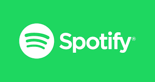

# Recipe to the perfect song

## Exploration of song popularity on Spotify

The purpose of these analyses was to determine the perfect elements to create a chart topping song. The data source was the Spotify API, which can be accessed after getting an API token.

* Use the Spotify API to query for songs in 'Top Lists' playlist category using [/Analyses/nltk_lyric-sentiment_scores.ipynb](https://github.com/finianoneill/music-analysis/blob/master/elize-papineau/nltk_lyric-sentiment_scores.ipynb)
* Get song lyrics using Genius API using [/finian/Notebooks/Genius_API_Get-tracks-and-lyrics.ipynb](https://github.com/finianoneill/music-analysis/blob/master/finian/Notebooks/Genius_API_Get-tracks-and-lyrics.ipynb)

* Using [/Analyses/Streaming_Rates_for_Music_with_Lyrics_versus_Music_without_Lyrics.ipynb](https://github.com/finianoneill/music-analysis/blob/master/finian/Notebooks/Streaming_Rates_for_Music_with_Lyrics_versus_Music_without_Lyrics.ipynb) and [/Analyses/nltk_lyric-sentiment_scores.ipynb](https://github.com/finianoneill/music-analysis/blob/master/elize-papineau/nltk_lyric-sentiment_scores.ipynb) and [Analyses/Word Frequency.ipynb](https://github.com/finianoneill/music-analysis/blob/master/ruturaj/Word%20Frequency.ipynb), the following questions were attempted to be addressed:

1 Does “instrumentalness” affect song popularity?
2 Does genre affect song popularity?
3 Are positive or negative songs more popular?
4 Within the top spotify playlists, which words/phrases are used most frequently?